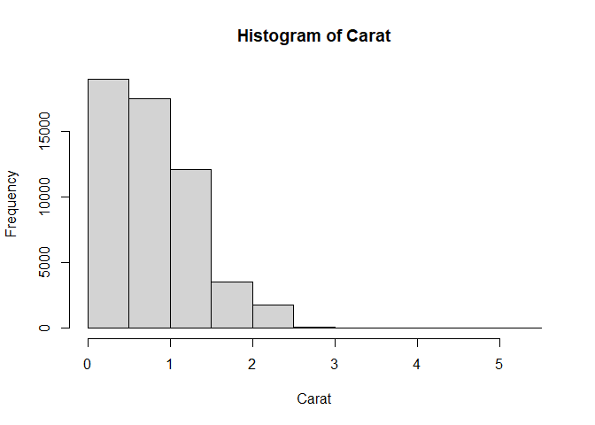
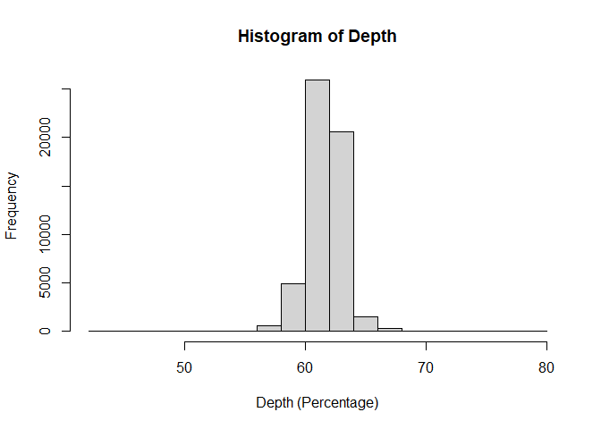
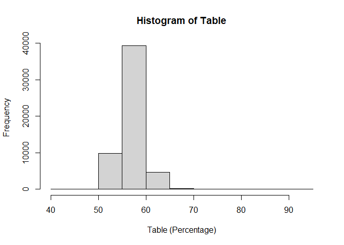
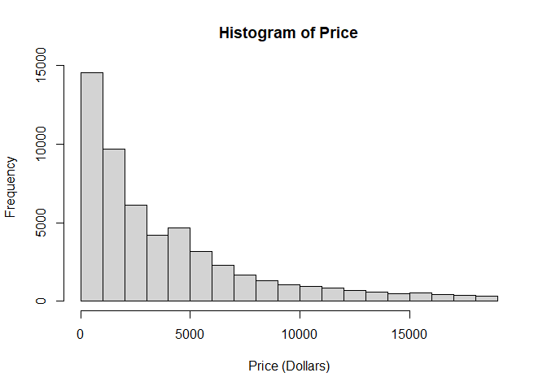
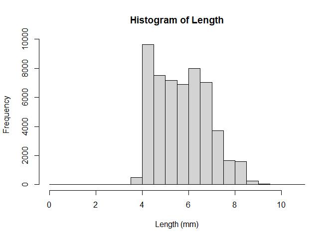
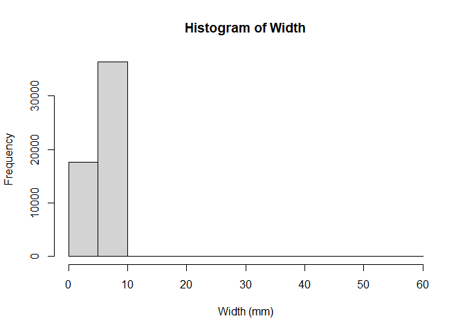
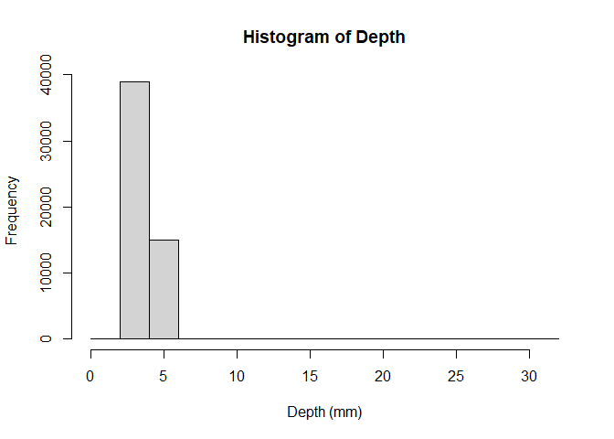
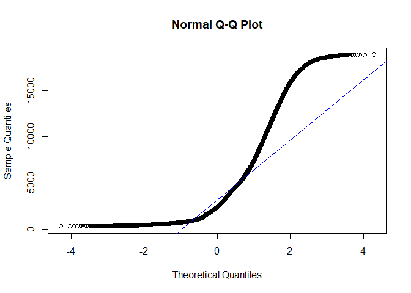
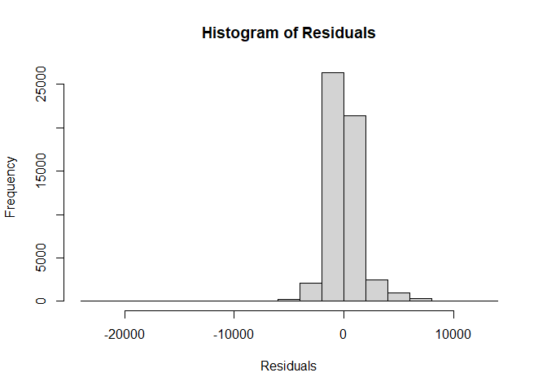

# Introduction

This project uses [this diamond sales
dataset](https://www.kaggle.com/datasets/sahilnbajaj/diamonds-sale-data)
containing the attributes of almost 54,000 diamonds. My aim is to create
a linear model that predicts the price of the diamond from its
characteristics (carat, depth, table, x, y, z). For this project, I am
excluding the categorical variables because I do not yet have the
knowledge required to properly deal with them. The methods used in this
project are directly inspired by my Statistical Methods II coursework.

## Variables

-   carat: the mass of the diamond
-   cut: the quality of the cut of the diamond (Fair, Good, Very Good,
    Premium, Ideal)
-   color: the color of the diamond (from J worst to D best)
-   depth: the depth percentage of the diamond
-   table: the percentage of the facet which can be seen when the stone
    is viewed face up
-   price: price in dollars
-   x: length in mm
-   y: width in mm
-   z: depth in mm

# Preliminary Analysis

## Importing Dependencies

    library("tidyverse")

    ## ── Attaching core tidyverse packages ──────────────────────── tidyverse 2.0.0 ──
    ## ✔ dplyr     1.1.4     ✔ readr     2.1.5
    ## ✔ forcats   1.0.0     ✔ stringr   1.5.1
    ## ✔ ggplot2   3.5.1     ✔ tibble    3.2.1
    ## ✔ lubridate 1.9.3     ✔ tidyr     1.3.1
    ## ✔ purrr     1.0.2     
    ## ── Conflicts ────────────────────────────────────────── tidyverse_conflicts() ──
    ## ✖ dplyr::filter() masks stats::filter()
    ## ✖ dplyr::lag()    masks stats::lag()
    ## ℹ Use the conflicted package (<http://conflicted.r-lib.org/>) to force all conflicts to become errors

    library("Hmisc")

    ## 
    ## Attaching package: 'Hmisc'
    ## 
    ## The following objects are masked from 'package:dplyr':
    ## 
    ##     src, summarize
    ## 
    ## The following objects are masked from 'package:base':
    ## 
    ##     format.pval, units

## Loading The Data

    diamond_sales <- read.csv("C:/Users/kuehn/Documents/Personal-Projects/diamond_sales/data/diamonds.csv")
    head(diamond_sales)

    ##   carat       cut color clarity depth table price    x    y    z
    ## 1  0.23     Ideal     E     SI2  61.5    55   326 3.95 3.98 2.43
    ## 2  0.21   Premium     E     SI1  59.8    61   326 3.89 3.84 2.31
    ## 3  0.23      Good     E     VS1  56.9    65   327 4.05 4.07 2.31
    ## 4  0.29   Premium     I     VS2  62.4    58   334 4.20 4.23 2.63
    ## 5  0.31      Good     J     SI2  63.3    58   335 4.34 4.35 2.75
    ## 6  0.24 Very Good     J    VVS2  62.8    57   336 3.94 3.96 2.48

## Plotting The Variables

First, I created some histograms of the response and explanatory
variables to see how they are distributed.

    hist(diamond_sales$carat,main="Histogram of Carat",xlab="Carat")

The histogram of carat is right-skewed, meaning the mean carat
measurement of the dataset will be smaller than the median carat
measurement.

    hist(diamond_sales$depth,main="Histogram of Depth",xlab="Depth (Percentage)")

The histogram of depth percentage is approximately symmetric, meaning
that the mean and median values for depth percentage for the dataset
will be about equal.

    hist(diamond_sales$table,main="Histogram of Table",xlab="Table (Percentage)")

The histogram of table is approximately symmetric, meaning that the mean
and median values for table for the dataset will be about equal.

    hist(diamond_sales$price,main="Histogram of Price",xlab="Price (Dollars)")

The histogram of price is right-skewed, meaning that the mean price of
the dataset will be larger than the median price.

    hist(diamond_sales$x,main="Histogram of Length",xlab="Length (mm)")

The histogram of length is slightly skewed to the right, meaning that
the mean length of the dataset will be slightly larger than the median
length.

    hist(diamond_sales$y,main="Histogram of Width",xlab="Width (mm)")

The histogram of width is slightly left-skewed, meaning that the mean
width of the dataset will be slightly smaller than the median width.

    hist(diamond_sales$z,main="Histogram of Depth",xlab="Depth (mm)")

The histogram of depth is slightly skewed to the right, meaning that the
mean depth of the dataset will be slightly larger than the median depth

## Correlation Between All Pairs of Quantitative Variables

    diamond_sales_quant <- diamond_sales[,-c(2:4)] # Remove categorical variables

    # Create correlation matrix and compute p-value table
    cor_diamond_sales_quant <- rcorr(as.matrix(diamond_sales_quant))
    print(cor_diamond_sales_quant)

    ##       carat depth table price     x     y    z
    ## carat  1.00  0.03  0.18  0.92  0.98  0.95 0.95
    ## depth  0.03  1.00 -0.30 -0.01 -0.03 -0.03 0.09
    ## table  0.18 -0.30  1.00  0.13  0.20  0.18 0.15
    ## price  0.92 -0.01  0.13  1.00  0.88  0.87 0.86
    ## x      0.98 -0.03  0.20  0.88  1.00  0.97 0.97
    ## y      0.95 -0.03  0.18  0.87  0.97  1.00 0.95
    ## z      0.95  0.09  0.15  0.86  0.97  0.95 1.00
    ## 
    ## n= 53940 
    ## 
    ## 
    ## P
    ##       carat  depth  table  price  x      y      z     
    ## carat        0.0000 0.0000 0.0000 0.0000 0.0000 0.0000
    ## depth 0.0000        0.0000 0.0134 0.0000 0.0000 0.0000
    ## table 0.0000 0.0000        0.0000 0.0000 0.0000 0.0000
    ## price 0.0000 0.0134 0.0000        0.0000 0.0000 0.0000
    ## x     0.0000 0.0000 0.0000 0.0000        0.0000 0.0000
    ## y     0.0000 0.0000 0.0000 0.0000 0.0000        0.0000
    ## z     0.0000 0.0000 0.0000 0.0000 0.0000 0.0000

For the predictors, carat has the strongest positive correlation with
price (r=0.92). Length, width, and depth are also strongly positively
correlated with price (r=0.88, r=0.87, r=0.86 respectively).
Interestingly, depth percentage is weakly negatively correlated with
price (r=-0.01).Table has a weak positive correlation (r=0.13). It makes
sense that price increases as carat, length, width, and depth increase
since bigger diamonds cost more. Perhaps depth percentage is weakly
negatively correlated because the ideal depth percentage falls within a
specific range.

The p-value table for the correlation test between all pairs of
quantitative variables shows that there is a significant correlation
between each pair of variables at the 0.05 level.

Now that the preliminary analysis is complete, a multiple linear
regression model can be created including all the variables.

# Linear Regression Model

## Checking Conditions

To use a linear regression model, I need to check the following
conditions:

-   Linearity
-   Consistent variability
-   Normal residuals

### Linearity & Consistent Variability Conditions

    qqnorm(diamond_sales$price)
    qqline(diamond_sales$price, col="blue")

From the QQPlot, the quantile points do not lie on the theoretical
normal line, thus the linearity and consistent variability conditions
are not satisfied.

### Normal Residuals Condition

    attach(diamond_sales_quant)
    model1 <- lm(price ~ carat + depth + table + x + y + z) # Create initial linear model
    hist(model1$residuals,main="Histogram of Residuals",xlab="Residuals")

The histogram of residuals is approximately symmetric, therefore the
data meets the normalcy criteria.

While not all of the criteria for multiple linear regression are met,
for the sake of practice I will continue (but with caution!).

## Linear Model

### First Model

    summary(model1)

    ## 
    ## Call:
    ## lm(formula = price ~ carat + depth + table + x + y + z)
    ## 
    ## Residuals:
    ##      Min       1Q   Median       3Q      Max 
    ## -23878.2   -615.0    -50.7    347.9  12759.2 
    ## 
    ## Coefficients:
    ##              Estimate Std. Error t value Pr(>|t|)    
    ## (Intercept) 20849.316    447.562  46.584  < 2e-16 ***
    ## carat       10686.309     63.201 169.085  < 2e-16 ***
    ## depth        -203.154      5.504 -36.910  < 2e-16 ***
    ## table        -102.446      3.084 -33.216  < 2e-16 ***
    ## x           -1315.668     43.070 -30.547  < 2e-16 ***
    ## y              66.322     25.523   2.599  0.00937 ** 
    ## z              41.628     44.305   0.940  0.34744    
    ## ---
    ## Signif. codes:  0 '***' 0.001 '**' 0.01 '*' 0.05 '.' 0.1 ' ' 1
    ## 
    ## Residual standard error: 1497 on 53933 degrees of freedom
    ## Multiple R-squared:  0.8592, Adjusted R-squared:  0.8592 
    ## F-statistic: 5.486e+04 on 6 and 53933 DF,  p-value: < 2.2e-16

Because depth (z) is not significant, I am removing it from the model.

### Second Model

    model2 <- lm(price ~ carat + depth + table + x + y) # Create linear model
    summary(model2)

    ## 
    ## Call:
    ## lm(formula = price ~ carat + depth + table + x + y)
    ## 
    ## Residuals:
    ##      Min       1Q   Median       3Q      Max 
    ## -23872.1   -614.8    -50.5    347.5  12759.4 
    ## 
    ## Coefficients:
    ##              Estimate Std. Error t value Pr(>|t|)    
    ## (Intercept) 20702.947    419.575  49.343  < 2e-16 ***
    ## carat       10686.707     63.199 169.095  < 2e-16 ***
    ## depth        -200.718      4.855 -41.344  < 2e-16 ***
    ## table        -102.490      3.084 -33.234  < 2e-16 ***
    ## x           -1293.542     36.063 -35.869  < 2e-16 ***
    ## y              69.575     25.287   2.751  0.00594 ** 
    ## ---
    ## Signif. codes:  0 '***' 0.001 '**' 0.01 '*' 0.05 '.' 0.1 ' ' 1
    ## 
    ## Residual standard error: 1497 on 53934 degrees of freedom
    ## Multiple R-squared:  0.8592, Adjusted R-squared:  0.8592 
    ## F-statistic: 6.583e+04 on 5 and 53934 DF,  p-value: < 2.2e-16

### Final Model Interpretation

Now that all the variables are significant, my final regression equation
is:

*P**r**i**c**e* = 20702.94 + 10686.70 \* *C**a**r**a**t* − 200.71 \* *D**e**p**t**h**P**e**r**c**e**n**t**a**g**e* − 102.49 \* *T**a**b**l**e* − 1293.54 \* *L**e**n**g**t**h* + 69.57 \* *W**i**d**t**h*
For every additional carat, there is a $10686.70 increase in price. For
every 1% increase in depth percentage, there is a $200.71 decrease in
price. For every 1% increase in table, there is a $102.49 decrease in
price. For every 1 mm increase in length, there is a $1293.54 decrease
in price. For every 1 mm increase in width, there is a $69.57 increase
in price. The intercept in this case does not make much sense because a
diamond with dimensions 0 mm x 0 mm x 0 mm would not have a price of
$20702.94.

### F-Test

The R output includes an F-test that can be used to assess the
usefulness of the multiple linear regression model. To understand these
values, I need to create null and alternative hypotheses.

*L**e**t* *β*0 = *P**r**i**c**e* *I**n**t**e**r**c**e**p**t*, *β*1 = *C**a**r**a**t* *C**o**e**f**f**i**c**i**e**n**t*, *β*2 = *D**e**p**t**h* *P**e**r**c**e**n**t**a**g**e* *C**o**e**f**f**i**c**i**e**n**t*, *β*3 = *T**a**b**l**e*, *β*4 = *L**e**n**g**t**h*, *β*5 = *W**i**d**t**h*
*H*0 : *β*1 = *β*2 = *β*3 = *β*4 = *β*5, *H**a* : *N**o**t* *a**l**l* *β**k* *f**o**r* (*k*=0,1,..,*k*)
The null hypothesis states that all the regression coefficients will be
equal to zero, i.e. testing if the model does not effectively predict
price from its characteristics. The alternative hypothesis states at
least one of the regression coefficients is not equal to zero, i.e. the
model is effective at predicting price from its characteristics but
further analysis is needed to determine the significance of the
regression coefficients.

The degrees of freedom for this test is equal to n-k-1, therefore the df
is 53934.

The F-statistic from the R output is 6.583 \* 104. This large
F-statistic indicates a p-value close to 0. From the R output, the
p-value is  &lt; 2.2 \* 10−16; since this p-value is less
than 0.05, I can reject the null hypothesis and conclude that there is
sufficient evidence that the model is effective at predicting price from
carat, depth percentage, table, length, and width.

### T-Tests On All Regression Coefficients

Next, a t-test must be performed on all the regression coefficients to
determine if the variable is significant to the model after all other
variables are added to the model.

*L**e**t* *β*0 = *P**r**i**c**e* *I**n**t**e**r**c**e**p**t*, *β*1 = *C**a**r**a**t* *C**o**e**f**f**i**c**i**e**n**t*, *β*2 = *D**e**p**t**h* *P**e**r**c**e**n**t**a**g**e* *C**o**e**f**f**i**c**i**e**n**t*, *β*3 = *T**a**b**l**e*, *β*4 = *L**e**n**g**t**h*, *β*5 = *W**i**d**t**h*
For the first regression coefficient, *β*1:
*H*0 : *β*1 = 0, *H**a* : *β*1 ≠ 0
The null hypothesis states that the regression coefficient for carat
will be equal to zero, i.e. carat is not a significant predictor of
price when all other variables are included in the model. The
alternative hypothesis states that the regression coefficient for carat
will not be equal to zero, i.e. carat is a significant predictor of
price when all other variables are not included in the model.

Degrees of freedom is equal to n-k-1, therefore the df is 53934.

From the R output, the T-statistic is 169.095. A large T-statistic
indicates a p-value close to zero. From the R output, the p-value is
 &lt; 2 \* 10−16; since this p-value is less than 0.05, I can
reject the null hypothesis and conclude there is sufficient evidence
that, after all other variables are added into the model and held
constant, carat is a significant predictor of diamond price.

For the second regression coefficient, *β*2:
*H*0 : *β*2 = 0, *H**a* : *β*2 ≠ 0
The null hypothesis states that the regression coefficient for depth
percentage will be equal to zero, i.e. depth percentage is not a
significant predictor of price when all other variables are included in
the model. The alternative hypothesis states that the regression
coefficient for depth percentage will not be equal to zero, i.e. depth
percentage is a significant predictor of price when all other variables
are not included in the model.

Degrees of freedom is equal to n-k-1, therefore the df is 53934.

From the R output, the T-statistic is -41.344. A large T-statistic
indicates a p-value close to zero. From the R output, the p-value is
 &lt; 2 \* 10−16; since this p-value is less than 0.05, I can
reject the null hypothesis and conclude there is sufficient evidence
that, after all other variables are added into the model and held
constant, depth percentage is a significant predictor of diamond price.

For the third regression coefficient, *β*3:
*H*0 : *β*3 = 0, *H**a* : *β*3 ≠ 0
The null hypothesis states that the regression coefficient for table
will be equal to zero, i.e. table is not a significant predictor of
price when all other variables are included in the model. The
alternative hypothesis states that the regression coefficient for table
will not be equal to zero, i.e. table is a significant predictor of
price when all other variables are not included in the model.

Degrees of freedom is equal to n-k-1, therefore the df is 53934.

From the R output, the T-statistic is -33.234. A large T-statistic
indicates a p-value close to zero. From the R output, the p-value is
 &lt; 2 \* 10−16; since this p-value is less than 0.05, I can
reject the null hypothesis and conclude there is sufficient evidence
that, after all other variables are added into the model and held
constant, table is a significant predictor of diamond price.

For the fourth regression coefficient, *β*4:
*H*0 : *β*4 = 0, *H**a* : *β*4 ≠ 0
The null hypothesis states that the regression coefficient for length
will be equal to zero, i.e. length is not a significant predictor of
price when all other variables are included in the model. The
alternative hypothesis states that the regression coefficient for length
will not be equal to zero, i.e. length is a significant predictor of
price when all other variables are not included in the model.

Degrees of freedom is equal to n-k-1, therefore the df is 53934.

From the R output, the T-statistic is -35.869. A large T-statistic
indicates a p-value close to zero. From the R output, the p-value is
 &lt; 2 \* 10−16; since this p-value is less than 0.05, I can
reject the null hypothesis and conclude there is sufficient evidence
that, after all other variables are added into the model and held
constant, length is a significant predictor of diamond price.

For the fifth regression coefficient, *β*5:
*H*0 : *β*5 = 0, *H**a* : *β*5 ≠ 0
The null hypothesis states that the regression coefficient for width
will be equal to zero, i.e. width is not a significant predictor of
price when all other variables are included in the model. The
alternative hypothesis states that the regression coefficient for width
will not be equal to zero, i.e. width is a significant predictor of
price when all other variables are not included in the model.

Degrees of freedom is equal to n-k-1, therefore the df is 53934.

From the R output, the T-statistic is 2.751. A large T-statistic
indicates a p-value close to zero. From the R output, the p-value is
0.00594; since this p-value is less than 0.05, I can reject the null
hypothesis and conclude there is sufficient evidence that, after all
other variables are added into the model and held constant, width is a
significant predictor of diamond price.

# Conclusion

From this work, I have drawn the following conclusions (cautiously, as
the criteria for multiple linear regression were not fully met):

-   There is is sufficient evidence that the model is effective at
    predicting price from carat, depth percentage, table, length, and
    width.
-   There is sufficient evidence that, after all other variables are
    added into the model and held constant, carat is a significant
    predictor of diamond price.
-   There is sufficient evidence that, after all other variables are
    added into the model and held constant, depth percentage is a
    significant predictor of diamond price.
-   There is sufficient evidence that, after all other variables are
    added into the model and held constant, table is a significant
    predictor of diamond price.
-   There is sufficient evidence that, after all other variables are
    added into the model and held constant, length is a significant
    predictor of diamond price.
-   There is sufficient evidence that, after all other variables are
    added into the model and held constant, width is a significant
    predictor of diamond price.
-   The final model that can be used to predict price:
    *P**r**i**c**e* = 20702.94 + 10686.70 \* *C**a**r**a**t* − 200.71 \* *D**e**p**t**h**P**e**r**c**e**n**t**a**g**e* − 102.49 \* *T**a**b**l**e* − 1293.54 \* *L**e**n**g**t**h* + 69.57 \* *W**i**d**t**h*
